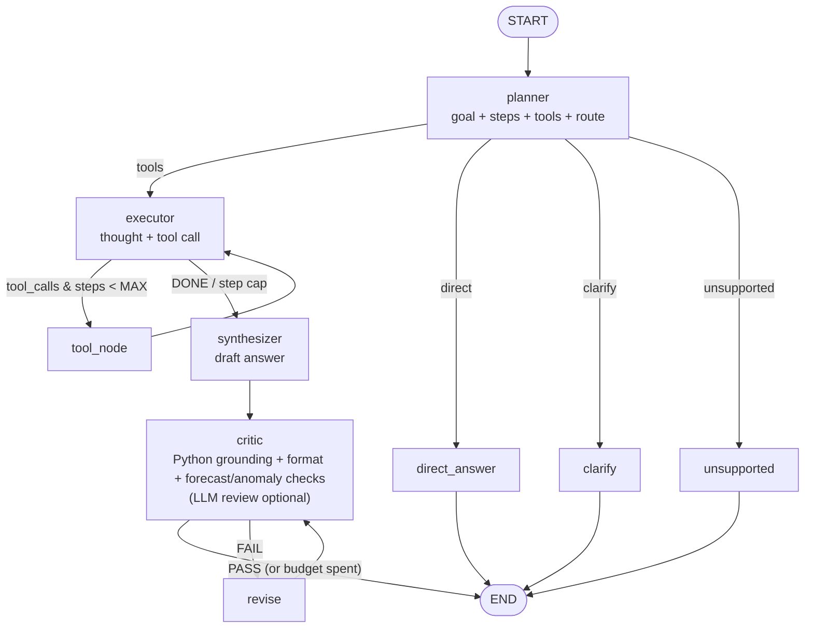

# 📊 Insight Copilot

A **reasoning, tool-using analytics chatbot** built on **LangGraph**. Ask questions about the
[Superstore Sales (time-series) dataset](https://www.kaggle.com/datasets/rohitsahoo/salesforecasting) in plain
English; the agent plans, picks the right tool(s), and answers like an analyst - *answer, supporting numbers, why it matters* -
with the full reasoning trace one click away.

> **Live demo:** `<your-streamlit-url>` &nbsp;·&nbsp; free-tier apps sleep when idle - the first load can take ~30 s, that is not a crash.

---

## What it does

| Requirement | How it is met |
|---|---|
| LangGraph `StateGraph`, typed state, conditional edges | `insight_copilot/graph.py` - `AgentState` (TypedDict), 9 nodes, 3 conditional edges (planner route, executor loop, critic verdict) |
| Visible reasoning before acting | Planner writes a structured plan; the executor records a thought before each tool call; everything is stored in `state["trace"]` and shown live and in a **🧠 Show reasoning** panel |
| ≥ 3 tools, chosen per query | 5 tools: `query_data`, `analyze_stats`, `create_chart`, `forecast_sales`, `web_search` (the UI shows *Tools selected* and *Execution* per answer) |
| Insights, not raw dumps | Synthesizer prompt enforces **Answer → Supporting numbers → Why it matters** (an *analytical* takeaway: where the gap is concentrated, which segment drives it), numbers only from tool observations |
| Verification | **`critic` node**: every figure must match (or be a simple derivation of) a tool observation; required sections, non-generic takeaway and chart mention are checked; forecast horizon/period and cautious anomaly wording are verified in **Python** (no extra LLM call); an LLM reviewer is optional (`CRITIC_LLM_REVIEW=1`). The UI lists each check. FAIL → `revise` → `critic` (max 2 rounds) |
| Tested decisions | **`evals/`**: 19 labelled questions (ranking, comparison, trend, chart, forecast, anomaly, multi-tool, follow-ups, unsupported) checking route + tool choice (+ pandas ground truth) - `python evals/run_evals.py` |
| Multi-step tool use | Executor loop (`executor ⇄ tool_node`, max 6 turns): e.g. compare → chart, or a failed call → corrected retry |
| Graceful "no tool for that" | `unsupported` route (e.g. profit/margin - not in the data) and `clarify` route for ambiguity |
| Multi-turn chat | LangGraph checkpointer (`MemorySaver`) keyed by session `thread_id`; history is passed to planner/executor/synthesizer |
| Chat UI + public hosting | Streamlit (`app.py`) → Streamlit Community Cloud / HF Spaces |

## Architecture



More detail (state table, routing functions, tools): [`docs/architecture.md`](docs/architecture.md).
Design write-up: [`docs/writeup.md`](docs/writeup.md).
To regenerate the diagram straight from the compiled graph: `python scripts/export_graph.py`.

### Tools

| Tool | Use it for | Notes |
|---|---|---|
| `query_data` | Rankings, totals, breakdowns by region/category/product/… and by month/quarter/year | Typed args + filters; helpful errors list valid values |
| `analyze_stats` | Growth (YoY), trend, **seasonality**, **anomalies**, share of total, **A-vs-B comparison with gap drivers**, dataset summary | Robust z-score on seasonally-adjusted months + IQR outlier orders |
| `create_chart` | Line / bar / pie / seasonality heatmap | Plotly; returned as an artifact and rendered under the answer |
| `forecast_sales` | "Next 6 months" | Holt-Winters; reports backtest MAPE; seasonal-naive fallback |
| `web_search` | Context outside the dataset | DuckDuckGo via `ddgs`; degrades gracefully if unavailable |

---

## Setup

### 1. Get the dataset (required for real results)

Download `train.csv` from [Kaggle → rohitsahoo/salesforecasting](https://www.kaggle.com/datasets/rohitsahoo/salesforecasting)
and place it at **`data/train.csv`** (commit it - it is ~2 MB, so the hosted app needs no local setup).

```bash
kaggle datasets download -d rohitsahoo/salesforecasting -p data --unzip   # then keep only train.csv
```

If `data/train.csv` is missing, the app falls back to a **synthetic sample with the same schema** (shows a warning banner) so it never crashes.

### 2. Get a free LLM key
Default provider is **Groq** (free tier, model `openai/gpt-oss-120b`; override with `LLM_MODEL`). If the main model errors or hits its rate limit, the app automatically retries on `LLM_FALLBACK_MODEL` (default for Groq: `openai/gpt-oss-20b`; set `none` to disable, or `LLM_FALLBACK_PROVIDER=google` for a different provider): <https://console.groq.com/keys>.
Other providers: set `LLM_PROVIDER` to `google`, `openai` or `anthropic`, install the matching `langchain-*` package, and set the key
(`GOOGLE_API_KEY` / `OPENAI_API_KEY` / `ANTHROPIC_API_KEY`). Optional `LLM_MODEL` overrides the model.

### 3. Run locally
```bash
python -m venv .venv && source .venv/bin/activate
pip install -r requirements.txt
cp .env.example .env            # add your GROQ_API_KEY
streamlit run app.py
# or, in the terminal:
python scripts/cli.py "Compare West and South and explain the gap"
```

### 4. Deploy (Streamlit Community Cloud - free)
1. Push this repo to GitHub (public, or private + add the reviewers as collaborators). **Do not commit `.env` or `secrets.toml`** (both are git-ignored).
2. <https://share.streamlit.io> → *New app* → pick the repo, branch `main`, main file `app.py`.
3. *Advanced settings → Secrets*, paste:
   ```toml
   GROQ_API_KEY = "your_key_here"
   ```
4. Deploy, then open the URL in an incognito window to verify. (Hugging Face Spaces also works: SDK = Streamlit, add `GROQ_API_KEY` under *Repository secrets*.)

### Tests
```bash
pytest -q        # 27 offline tests: analytics, critic, graph control-flow (fake LLM), LLM fallback, eval grader, no-secrets-in-repo check; no API key needed
```

---

### Troubleshooting LLM errors
```bash
python scripts/diag_llm.py     # tests the primary and fallback model separately and prints the real error (no keys shown)
```
In `run_evals.py`, a provider failure (rate limit, bad key, wrong model name) at the planner **or** executor is shown as `ERR`
and excluded from the scores; it is not counted as an agent mistake. If both models fail, the traceback now also lists the backup's error.

### Evaluate the agent (needs an LLM key)
```bash
python evals/run_evals.py --route-only      # planner only: fast/cheap routing check
python evals/run_evals.py --delay 3 -v      # full agent, free-tier friendly, with traces
python evals/run_evals.py --out evals/last_run.json --threshold 0.8
```
Each labelled question in `evals/questions.json` (+ `expected_routes.json`) is run through the real graph and scored
`question → actual route → actual tools → expected → PASS/FAIL`; two questions also check a pandas-computed figure in the answer.
Prints route accuracy, tool-selection accuracy and critic pass-rate. Results depend on the model - run it against the one you deploy.

## Example conversations (and the path the agent should take)

| Question | Route → tools |
|---|---|
| "What were the top 3 sub-categories by sales last quarter?" | tools → `query_data` (Q4 2018 dates) |
| "Is there a seasonal trend in sales for Furniture?" | tools → `analyze_stats(seasonality, category=Furniture)` (+ optional heatmap) |
| **Flagship multi-tool demo:** "Compare West and South sales, explain what is driving the difference, and show me a chart." | tools → `analyze_stats(compare_groups, driver=category)` → `create_chart` → synthesizer → critic → answer + chart |
| "Summarize anything unusual in this data." | tools → `analyze_stats(anomalies)` (+ `summary`) |
| "Forecast sales for the next 6 months" | tools → `forecast_sales` |
| "What was our profit margin last year?" | **unsupported** - no profit data; suggests alternatives |
| "Hi! What can you do?" | **direct** - no tools |
| "And for the Central region?" (follow-up) | uses conversation history to reuse the previous question's shape |

## Using the app

Type any question in the chat box, **or** pick one from the sidebar (grouped by type: rankings, compare, trends & charts,
forecast, unusual patterns, follow-ups, edge cases). Under every answer, **🧠 Show reasoning** opens the plan, the tools
selected and run, each tool call, and the individual self-check results; the sidebar toggle opens it automatically.

## Memory, persistence, streaming and observability

| Feature | What it does | Honest limits |
|---|---|---|
| **Short-term memory** | The agent remembers the conversation per chat (LangGraph checkpointer keyed by `thread_id`); the last 8 messages go to the planner/executor/synthesizer so follow-ups ("and for Central?", "show that as a chart") resolve | Older messages stay in the saved state but are not sent to the model. **New conversation** clears memory |
| **Persistence** | The chat's id lives in the page URL (`?t=...`), so a **page refresh restores the conversation** (text only). Set `CHECKPOINT_DB=checkpoints.db` (+ `pip install langgraph-checkpoint-sqlite`) to save memory to SQLite so it also **survives server restarts** | Charts and reasoning traces are not stored, only the messages. Streamlit Community Cloud has an ephemeral disk, so the SQLite file resets when the app is rebuilt. Anyone with the URL can open that conversation |
| **Streaming** | The reasoning steps (plan, each tool call, each self-check) stream live as LangGraph nodes finish; the verified answer is then revealed word by word | The answer is deliberately **not** token-streamed from the model: the critic must verify it *before* the user sees it |
| **Observability** | One structured record per question (route, tools planned/run, tool errors, revisions, self-check result, latency, model) is appended to `logs/turns.jsonl` (`TURN_LOG=off` disables) and shown as **📈 Session metrics** in the sidebar (avg/p95 latency, tool usage, self-check pass rate, errors) | The log stores the question text, so do not log sensitive data. For full prompt/token traces set `LANGSMITH_TRACING=true` and `LANGSMITH_API_KEY` (no code change) |

## Free-tier token tips (settings only - no code changes)

Defaults already minimise LLM calls: the self-check is Python-only (`CRITIC_LLM_REVIEW=0`) and the executor only receives
the tools named in the planner's structured plan (`ENFORCE_PLANNED_TOOLS=1`; set `0` to give it all tools). Add to `.env`
locally or to Streamlit *Secrets* when deployed:

```toml
LLM_PROVIDER = "google"                # or "groq"
LLM_MODEL = "gemini-3.6-flash"         # use a model name your own account lists
# Optional backup model/provider with its own quota (a wrong model name is hidden behind the first error, so verify it):
# LLM_FALLBACK_PROVIDER = "groq"
# LLM_FALLBACK_MODEL = "<a model listed in your Groq console>"
# CRITIC_LLM_REVIEW = "1"              # re-enable the LLM reviewer (1 extra call per answer)
```
(`langchain-google-genai` is in `requirements.txt` for the Google provider.)

## Known limitations & assumptions

- **Only `Sales` is measurable.** The dataset has no profit, quantity, or discount; the agent says so instead of guessing.
- **Relative dates** ("last quarter") resolve against the dataset's latest order date (Dec 2018), not today; the answer states the assumption.
- The data spans 2015-2018 (~9.8k rows); duplicate rows are dropped on load; dates are parsed day-first.
- **No arbitrary code execution.** An earlier `run_python` tool was removed from the hosted app: the five structured tools cover the brief, and running model-written code on a public server is a security risk. Questions needing custom logic route to `unsupported`.
- The **critic** verifies figures against tool output and simple derivations (differences, sums, ratios, % change); it can't validate a *causal* claim, and after 2 failed revisions it ships the draft with a visible caveat rather than looping.
- `MemorySaver` keeps conversations in process memory - they reset if the server restarts.
- **Free-tier rate limits:** each question makes ~6-8 LLM calls, so Groq's daily token cap can run out. The app falls back to a second model automatically; if both are exhausted it says so plainly (no crash). The Python-only self-check (default) already saves one call per answer.
- Quality depends on the LLM; free-tier models occasionally mis-pick a tool or hit rate limits. Tool errors and model errors are caught and surfaced, and the executor gets a chance to self-correct.
- **Forecasts are dataset-relative and approximate.** "Next 6 months" means the 6 months after the data ends (Jan-Jun 2019), not after today. The tool reports the method, a 6-month hold-out MAPE and MAE, and a seasonal-naive baseline for comparison; a code-written note is appended to every forecast answer. One backtest window does not bound future error.
- **Anomalies are statistical flags**, not proof of a structural business change; the tool output, prompt and critic all say so.
- Web search is optional and may be blocked/rate-limited on some hosts; the agent then answers from the dataset and says so.

## Project structure

```
app.py                     Streamlit chat UI (live reasoning, charts, multi-turn)
insight_copilot/
  graph.py                 LangGraph: AgentState, nodes (planner … synthesizer, critic, revise), conditional edges, prompts
  tools.py                 5 LangChain tools (typed, error-tolerant)
  observability.py         per-turn records, JSONL log, session metrics (pure Python)
  analytics.py             pure-pandas analytics (query, growth, trend, seasonality, anomalies, compare, forecast)
  charts.py                Plotly figure builders
  critic.py                deterministic answer checks (figures grounded in observations, format, takeaway)
  data.py / sample_data.py loader, startup data-quality checks, data card for prompts, synthetic fallback
  config.py                LLM factory + secrets (env / Streamlit secrets)
scripts/                   cli.py, export_graph.py, make_sample_data.py
evals/                     questions.json, expected_routes.json, run_evals.py  (agent routing / tool-choice evaluation)
tests/                     offline tests: analytics, critic + graph control-flow (fake LLM), eval grader
docs/                      architecture.md, writeup.md, graph.mmd, assignment_checklist.md
```
