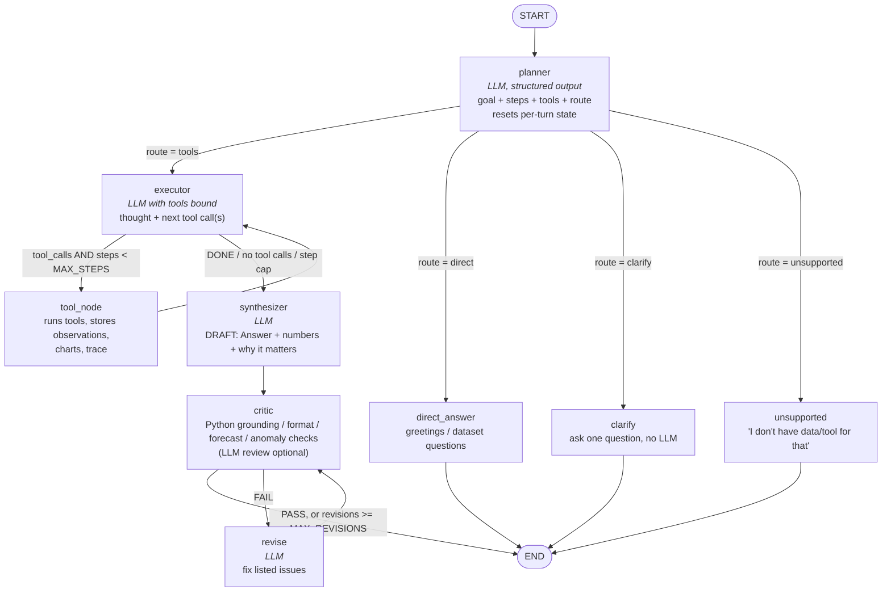

# Architecture - Insight Copilot state graph

## Conditional edges

| Edge | Function | Decision |
|---|---|---|
| `planner -> ...` | `route_after_planner` | `state["route"]` chosen by the planner LLM: needs tools / answer directly / ambiguous / impossible with this data |
| `executor -> ...` | `route_after_executor` | last work message has `tool_calls` **and** `steps < MAX_STEPS` -> `tool_node`; otherwise -> `synthesizer` |
| `critic -> ...` | `route_after_critic` | verdict passed, or `revisions >= MAX_REVISIONS` -> `END`; otherwise -> `revise` -> `critic` |

## Typed state (`AgentState`)

| Key | Lifetime | Purpose |
|---|---|---|
| `messages` | whole conversation (checkpointed per `thread_id`) | user questions + final answers -> multi-turn memory |
| `plan`, `route` | per turn | structured plan and routing decision |
| `work` | per turn | executor scratchpad (AI tool-call + ToolMessages) |
| `observations` | per turn | `{tool, args, output}` fed to the synthesizer |
| `trace` | per turn | visible reasoning trace rendered in the UI |
| `charts` | per turn | Plotly JSON produced by tools |
| `steps`, `revisions` | per turn | loop guards (executor turns, critic rounds) |
| `draft`, `draft_ok`, `critique` | per turn | synthesizer/reviser output awaiting verification; latest critic verdict |
| `answer` | per turn | final text (set by the critic when it publishes; also appended to `messages`) |

## The critic

Checks (`insight_copilot/critic.py`, pure Python): each figure in the answer must match a tool-observation number within rounding, or be a
simple derivation of two of them (difference, sum, ratio, %, % change); the three required sections exist; "Why it matters" is not a generic
platitude; a created chart is referenced (any natural wording, e.g. "shown below"); for forecasts the stated horizon matches the tool and the forecast
months are named; for anomalies the answer does not claim a "structural shift". Each check is listed in the UI. An optional LLM reviewer
(`CRITIC_LLM_REVIEW=1`, off by default to save tokens) judges *answers the question* and *takeaway is analytical*. For forecast answers the critic node
appends a code-written note (method, validation window, MAPE vs seasonal-naive baseline, dates, "estimate not guarantee").
On failure the issues are fed to `revise`; after `MAX_REVISIONS` the draft ships with a visible caveat listing unverifiable figures.

## Tools

| Tool | Chosen for | Backed by |
|---|---|---|
| `query_data` | rankings, totals, breakdowns by dimension/time | pandas groupby (`analytics.aggregate`) |
| `analyze_stats` | growth, trend, seasonality, anomalies, share, A-vs-B comparison with gap drivers, overview | pandas/numpy |
| `create_chart` | line / bar / pie / seasonality heatmap | Plotly |
| `forecast_sales` | future sales | Holt-Winters (statsmodels), seasonal-naive fallback |
| `web_search` | context outside the dataset | DuckDuckGo (`ddgs`) |

## Why each node exists

| Node | Why it is a separate node |
|---|---|
| `planner` | Decides route + writes the visible, structured plan (`goal`, `reasoning`, `steps`, `tools`) *before* any tool runs; resets per-turn state |
| `executor` / `tool_node` | Loop: the LLM picks the next tool call, `tool_node` runs it and records the observation, so multi-tool questions (stats -> chart) are real graph cycles |
| `direct_answer`, `clarify`, `unsupported` | Cheap terminal paths so greetings, ambiguity and impossible questions never touch tools (and never hallucinate) |
| `synthesizer` | Turns observations into Answer / Supporting numbers / Why it matters |
| `critic` / `revise` | Verifies the draft with Python checks and sends concrete issues back for at most `MAX_REVISIONS` rounds |

## How tool selection works

The planner's structured `tools` field is not decoration: the executor is bound **only to the tools the plan names** (all five if the
plan named none, or if `ENFORCE_PLANNED_TOOLS=0`). So the chain is *LLM decides -> structured plan -> graph passes only those tools to the
executor -> executor calls them in sequence*. Examples: "top 3 sub-categories" -> `query_data`; "monthly sales" -> `query_data` + `create_chart`;
"forecast" -> `forecast_sales`; "compare West and South and chart it" -> `analyze_stats` + `create_chart`; "stock price" -> `unsupported`, no tools.
`evals/` checks these choices against 19 labelled questions.

## Design decision: tools are capabilities, not one node each

A fixed fan-out of one graph node per tool would mean the *graph* hard-codes which tools run. Here the plan chooses and the executor loop
sequences them, so a new question shape needs no new edges. `analyze_stats` is a typed dispatcher over separate pure functions in
`analytics.py` (growth, trend, seasonality, anomalies, shares, comparison); splitting it into more tools would only add tool schemas to every
LLM call, which matters on free-tier token budgets.

## Forecast and anomaly semantics

- Forecast dates are **relative to the dataset** (last month: Dec 2018 -> forecast Jan-Jun 2019), never to today's date.
- `forecast_sales` trains on all history, but also hold-out-tests on the last 6 months and reports MAPE, MAE and a seasonal-naive baseline MAPE.
  A single window does not bound future error, and the appended note says so.
- Anomaly output is explicitly a statistical flag (robust z-score on seasonally-adjusted monthly sales; IQR fence on single orders), not a cause.

## Memory, persistence, streaming, observability

- **Short-term memory** is the checkpointed `messages` channel of `AgentState`, keyed by `thread_id`. Per-turn keys (`plan`, `work`,
  `observations`, ...) are reset by the planner each turn; only `HISTORY_TURNS` (8) recent messages are rendered into prompts.
- **Persistence**: `default_checkpointer()` returns `MemorySaver`, or a `SqliteSaver` when `CHECKPOINT_DB` is set (any failure falls back to memory).
  The UI keeps `thread_id` in the URL query string and rebuilds the transcript from `graph.get_state(...)` after a refresh.
- **Streaming**: `stream_turn` uses LangGraph's `stream_mode="updates"`, so every node's output (plan, tool call, critic verdict) reaches the UI as it
  completes. The final answer is shown only after the critic node approves it, then revealed progressively.
- **Observability**: `observability.summarize_turn()` derives one record per question from the existing `trace` (no extra instrumentation in the graph);
  `log_turn()` appends it to JSONL; `aggregate()` feeds the sidebar. LangSmith tracing works through environment variables alone.

